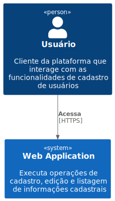
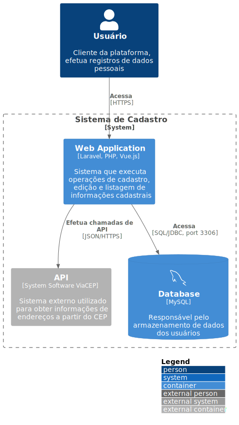
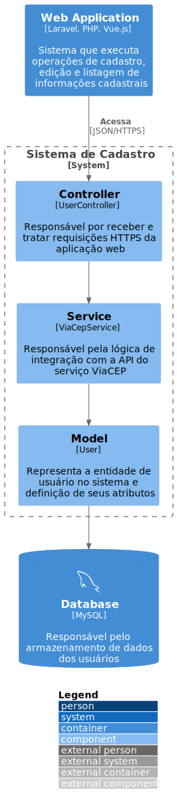

## Arquitetura de Software 
> Apresentação da visão arquitetural da infraestutura do sistema, seguindo a notação C4 Model.

### Diagramas:
  - **1º nível: Contexto do Sistema**
       - Ponto de partida. Exibe o sistema de software em escopo.
   

  - **2º nível: Contêineres**
       - Amplica o sistema de software, mostranso os blocos de contrução técnicos de alto nível.

  - **3º nível: Componentes**
       - Amplia os contêineres, mostrando os componentes dentro dele e suas atribuições.

